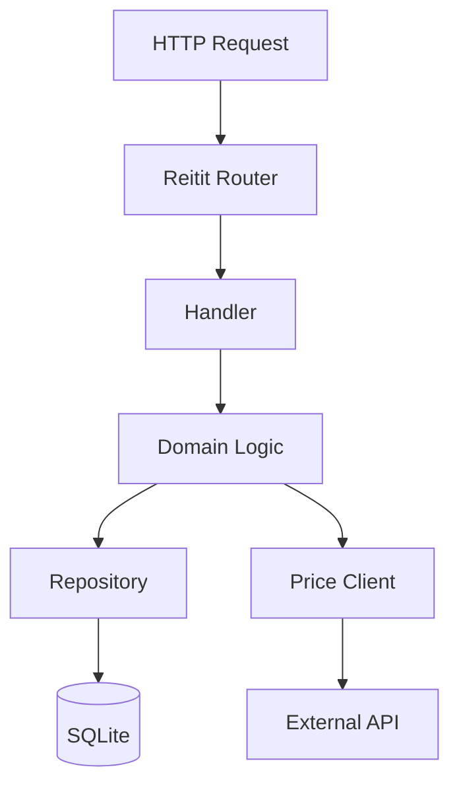

# investment-tracker

Track the value of investments over time — record buy/sell transactions, fetch historical prices, and calculate portfolio performance.

## Prerequisites

- Java 21+
- [Clojure CLI](https://clojure.org/guides/install_clojure) 1.12+

## Running

```bash
just run          # or: clojure -M:run
```

The server starts on port **3000** by default. Override with the `PORT` environment variable.

## Development

```bash
just repl          # or: clojure -A:dev
```

From the REPL:

```clojure
(go)    ;; start the system
(reset) ;; reload changed namespaces and restart
(halt)  ;; stop the system
```

## Testing

```bash
just test          # or: clojure -X:test
```

## Migrations

```bash
just migrate       # run pending migrations
just rollback      # roll back the last migration
```

## Docker

```bash
just docker-build  # or: docker build -t investment-tracker .
just docker-run    # or: docker run -p 3000:3000 investment-tracker
```

## Architecture



### Component lifecycle

Managed by [Integrant](https://github.com/weavejester/integrant). Configuration loaded via [Aero](https://github.com/juxt/aero) with per-environment `#profile` tags.

| Component | Key | Purpose |
|-----------|-----|---------|
| Config | `resources/config.edn` | Aero EDN with `#profile` tags || Datasource | `:investment-tracker.db/datasource` | HikariCP connection pool (SQLite) |
| Migrations | `:investment-tracker.db.migrate/migrations` | Migratus auto-migrate on startup || Routes | `:investment-tracker.handler/routes` | Reitit Ring handler |
| Server | `:investment-tracker.server/server` | Jetty HTTP server |

## Project plan

See [docs/plan.md](docs/plan.md) for the full roadmap.

